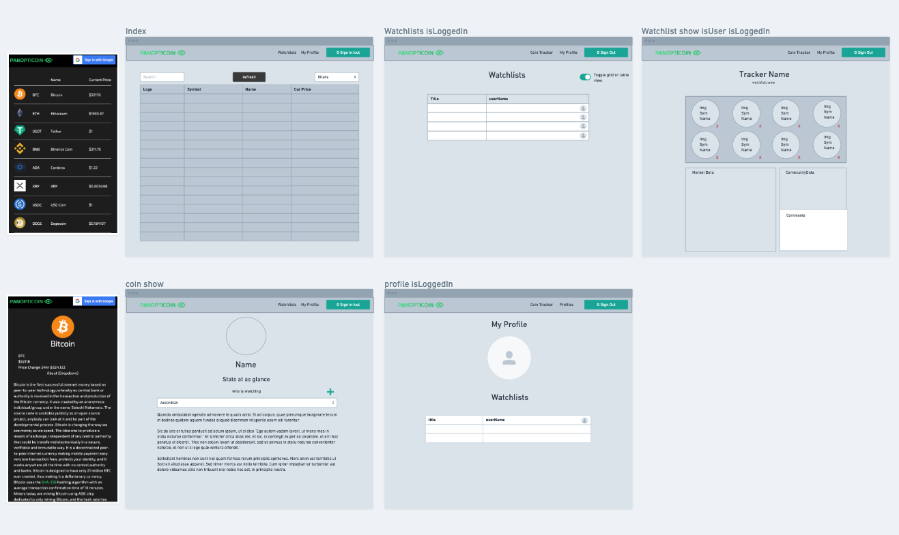
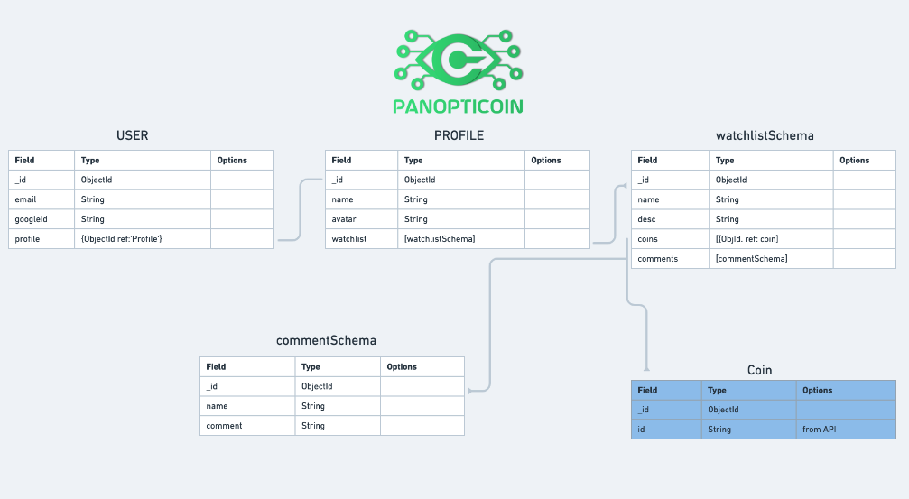
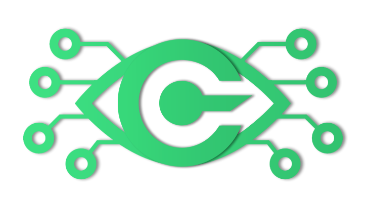

PanoptiCoin is a MEN stack Cryptocurrency tracker built on the CoinGecko API. 

## About

## Getting Started

The app is deployed on heroku [here](https://panopticoin.herokuapp.com/api/coins)

## Languages

* HTML
* CSS
* JavaScript

## Built With

* [CoinGeckoAPI](https://www.coingecko.com/en/api)
* [Mongoose](https://mongoosejs.com/)
* [Express](https://expressjs.com/)
* [Milligram](https://milligram.io/)
* [Font Awesome](https://fontawesome.com/)

## Authors

**Ian Terada** 

## Next Steps

* Robust search by name/symbol
* Quick add coins from index
* Light mode

## Wireframe

## ERD

